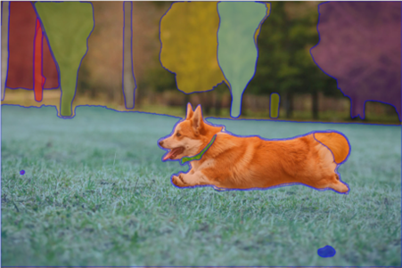
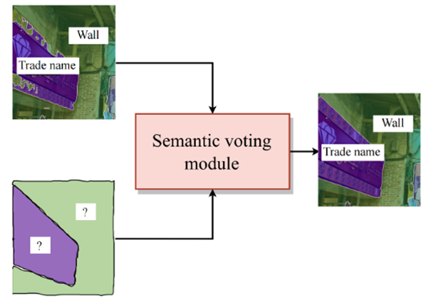

# Jittor Large Scale Unsupervised Semantic Segmentation (PASS + SAM)
	
## Introduction


Baseline:PASS, containing four steps. 1) A randomly initialized model is trained with self-supervision of pretext tasks。 2) A pixel-attention-based clustering scheme to obtain pseudo categories and assign generated categories to each image pixel. 3) Fine-tune the pre-trained model with the generated pseudo labels to improve the segmentation quality. 4) During inference, the LUSS model assigns generated labels to each pixel of images, same to the supervised model. 

This repo provides four solutions to improve mIoU score based on PASS model and Segment Anything Model. 

## Visualization


Results in th first line comes from PASS baseline. After improvement, object localization is more accurate and multiple objects can be detected.

## Description

**Adapter**

<div align="center">

</div>

**Saliency map**

<div align="center">

</div>

**Progressive upsampling**

<div align="center">

</div>

**Semantic voting**

<div align="center">
</div>

**Performance**


## Install 

Project implemented on 4 2080ti gpus. Training time in total is around 2 days.

#### Environment
- ubuntu 20.04 LTS
- python >= 3.7
- jittor >= 1.6.1

## Citation
```
@article{gao2022luss,
  title={Large-scale Unsupervised Semantic Segmentation},
  author={Gao, Shanghua and Li, Zhong-Yu and Yang, Ming-Hsuan and Cheng, Ming-Ming and Han, Junwei and Torr, Philip},
  journal=TPAMI,
  year={2022}
}
```

## Acknowledgement

Code is based on Paper [Large-scale Unsupervised Semantic Segmentation](https://arxiv.org/abs/2106.03149), refering to [segment-anything](https://github.com/facebookresearch/segment-anything) and [dino].(https://github.com/facebookresearch/dino)


